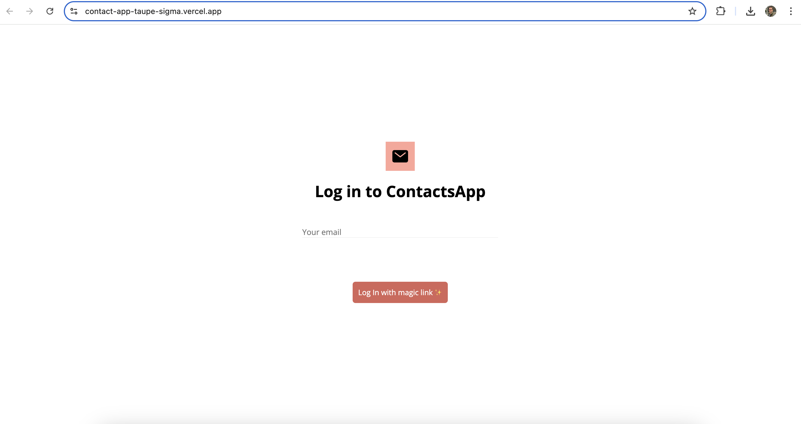

<h1>☎️ CONTACTS APP</h1>

This is a Contacts App project, similar to the one we have in iOS. 

You can test it live on this <a href="https://contact-app-taupe-sigma.vercel.app/">link</a>.

<h2>🧭 Some context</h2>

I'm a 2x founder that led Product and Growth strategies and teams from scratch to 40+ people and US$20+ million in revenue with an exit to a public-traded company.

As a seasoned tech entrepreneur with an engineering (not tech) background, I've always thought of learning to code as a way of becoming a better founder & tech leader. 

In July/24, I decided to go for it and have been learning on my own, through resources like Codecademy & Scrimba, and counting with the -incredible- mentorship of my previous Tech Lead.

This is my first portfolio-grade project and although I'm sure there's a lot of things to improve, I'm also very happy with the result and looking forward to keep learning.

Let's go build something great! 🤘

<h2>🧰 Built with</h2>
<ul>
    <li>App in React</li>
    <li>Data persisted in Supabase</li>
    <li>Navigation with React Router</li>
    <li>Hosted on Vercel</li>
    <li>Styling with CSS</li>
</ul>

<h2>✅ Features</h2>
I'm not reinventing the wheel here...
<ul>
    <li>Sign-in via Magic Link</li>
    <li>See real-time contact list by alphabetical order</li>
    <li>Add new contacts with name, phone and profile img</li>
    <li>Remove contact</li>
</ul>

But what I actually think that brought most value was to:
<ul>
    <li>Building something from scratch by myself</li>
    <li>Using map, spread operator & others</li>
    <li>Managing States & Context</li>
    <li>Setting up React forms</li>
    <li>Dealing with calls from the database with useEffect</li>
    <li>Setting up RLS, using & communicating real-time with a database</li>
    <li>Managing authentication & user permissions</li>
    <li>Implementing routing & navigation</li>
    <li>Creating responsive styling</li>
</ul>

<h2>🔮 Next features to implement</h2>
This got interesting and, as a beginner, I totally acknowledge that there are things to improve. A few of those include: 
<ul>
    <li>Add loading states</li>
    <li>Allow to sign-up with email+password or via gmail</li>
    <li>Add option to update contact</li>
    <li>Improve app structure between pages vs components</li>
    <li>Add more properties for each contact</li>
</ul>

<h2>💬 Feedbacks welcome</h2>

If you have any thoughts on it, feel free to reach out. I'd love to get some feedbacks and improve on my skills!

Cheers,
 
Senna
